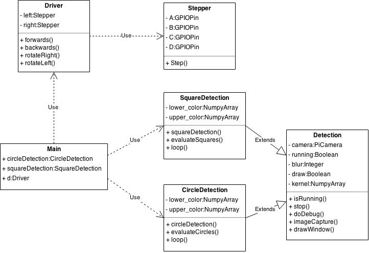
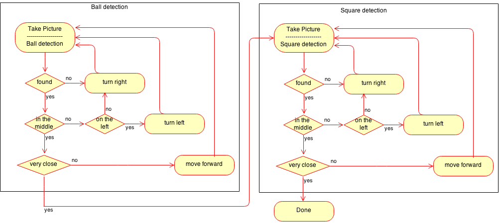

AMS Robot Documentation
=======================

Introduction
------------
This documentation is covering our research and implementation for our own autonomous robot. The idea was to walk through all the necessary steps to build an autonomous robot which is solving a predefined problem. The following section will cover our problem definition and the goals, we would like to achive at the end of our build.

### Problem Definition and Goals

The robot should solve the following problem: A colored ball should be found and moved to a colored square. 

We need to define some constraints for this problem definition, so that it gets simplified to an actual solvable task in the given time period. Both objects, the ball and the square goal, need to stay in places without any obstacles between the robot and itself. The surrounding area need to be a laboratory environment without any optical confusion or moving objects. There should also be a predefined and decent amount of light without any colored impact.

Our goal for the constrained task is to build a robot, which is solving this problem without time limits. But it should solve this problem autonomously.

Theoretische Vorbemerkung
-------------------------
*Hardware Basis(jojo)
*Pi
*Camera
*Schrittmotoren(Vollschritt/Halbschritt) Technische Details
*Energy+Communication

### Used Software

The mentioned raspberry pi is running different linux distributions such as Raspbian (based on debian), Pidora (based on Fedora) or Arch Linux and more. (http://www.raspberrypi.org/downloads/) The most spreaded and used distribution is Raspbian. It offers all the, in our case, used libraries in a prebuild format.

Depending on the Linux-based board, there are no limits to a used programming language. Many documentations about the controlling and usage of the raspberry pi are based on the Python programming language. In addition because of personal experiences we decided to use Python for this implementation.

##### Image processing with OpenCV

We will implement the ball detection with OpenCV. This library is designed for computational efficient and with a focus on real-time image processing because it can take advantage of the hardware acceleration.(http://opencv.org/) It is splitted in subprojects like the image feature recognition, image stitching or visualisation. We will mainly focus on the subprojects for image processing and video analysis to detect the two problem objects. OpenCV also offers programming interfaces for 

##### Modelling with OpenSCAD

Implementation
--------------

*Konstruktion(Jojo)
*Iterationen(Zahnräder)
*SCAD-STL-GCODE Workflow
*Slic3r

## Software

This subsection will present our python based implementation in detail. It shows the structure and the use of the mentioned framework in this project.

### Project Structure
Our project structure is quite simple and is shown in the following class diagram. There is one inheritence shown between the Detection and the two childs SquareDetection and CircleDetection. Detection is generalizin the whole access to the camera module and ech child is running the specific image processing, described in the following chapter. 

### Imageprocessing with OpenCV

#### Circle Deteciton
#### Square Detection

### Addressing Steppermotors

Each steppermotor has 4 input wires (A to D) to control the step movement of the inner restricted rotor. There are different modes to use a stepper motor which will effect the movement speed and torque. The first four colums are showing fullstep mode which will run fast with less torque. The second part is showing halfstep mode which will run fast but with less torque.

|       | A | B | C | D |   | A | B | C | D |
|-------|---|---|---|---|---|---|---|---|---|
| **1** | 1 | 0 | 0 | 0 |   | 1 | 0 | 0 | 0 |
| **2** | 0 | 1 | 0 | 0 |   | 1 | 1 | 0 | 0 |
| **3** | 0 | 0 | 1 | 0 |   | 0 | 1 | 0 | 0 |
| **4** | 0 | 0 | 0 | 1 |   | 0 | 1 | 1 | 0 |
| **5** |   |   |   |   |   | 0 | 0 | 1 | 0 |
| **6** |   |   |   |   |   | 0 | 0 | 1 | 1 |
| **7** |   |   |   |   |   | 0 | 0 | 0 | 1 |
| **8** |   |   |   |   |   | 1 | 0 | 0 | 1 |

In this project we don't needed to have too much torque and therefor we decided to use fullstep to gain a little bit more speed. The detailed pin addressing is happening in the Stepper class and it can handle both modes, depending on the input values from our Driver class.

### Zusammenspiel

The following image is showing the state mashine our implementation. It shows the two main loops for the circle or squardetection and also the decision situation for the driver controller. Each image capturing process is coming from one of the both detection implementation and each movement-sequenz is going to the diver instance d.

Evaluation(Jojo)
----------
*Ziele erreicht?
*Bilderreihe
*Kritik (RPI? ok?) ...
*RPI Schrittmotor Kritik

Usage
-----

Ausblick
--------
Our main problem for this hardware and software decision is performance as we reached a feedback loop time of round about 5 seconds. This is quite a long time and is caused by the calculation speed of the Raspberry Pi during the image processing. Of cause, speed wasn't the main goal for this project, thus we could actually tweak and change our implementation to gain some performance improvements. But still, there would be a big delay during the image processing.

To solve this issue we thought about outsourcing of the computationally intensive image processing. One way to do this is the ROS - Robot Operating System. 

## ROS

